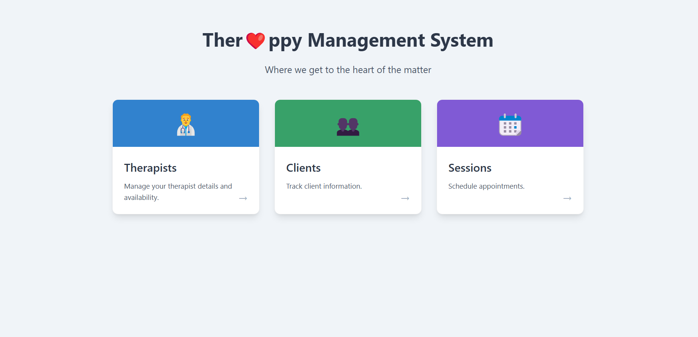

🧠 Therapist Client Management  
A full-stack session tracking app built using React (frontend) and Node.js/Express with MariaDB (managed via phpMyAdmin) on the backend. This project demonstrates my ability to build structured, full-stack applications with CRUD functionality and relational database integration.



---

🚀 Features  
👥 Assign clients to therapists  
📅 Add, edit, and delete session records  
📊 Table view of all sessions  
🔄 Axios for frontend-backend communication  
🎯 RESTful API using Express.js  
🗃️ MariaDB database managed via phpMyAdmin  
🎨 Custom styling with CSS  

---

⚙️ How to Run It

🔧 **Prerequisites**  
- Node.js & npm  
- MariaDB and phpMyAdmin installed (or running via something like XAMPP)

▶️ **Running the Backend and Frontend**
```bash
# Start backend
cd backend
node server.js
```
```bash
# Start frontend
cd frontend
npm install
npm run dev
```